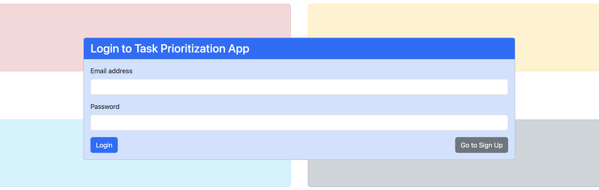

User Accounts
==================

To use the app, you need to create an account. Follow these step to sign up/log in.

Signing up
--------------
1. Navigate to the app's home page and click on the **Go to Sign Up** button.
2. Fill out the **Sign Up** form by entering your name, email address, and password.

* **Name**: Enter your full name.
* **Email Address**: Use a valid email address that you will use to log in.
* **Password**: Choose a strong password for security.

3. Click the **Sign Up** button to complete the registration process, and will log you in if successfully signed up.

Logging In 
----------------
.. NOTE:: 
    If you already have an account you can log in by following these steps.

1. Enter your registered **email address** and **password** into the login form.

2. Click the **Login** button to access your account.

After logging in, you will be redirected to the main dashboard where you can start managing your tasks.

User Management Endpoints
---------------------------

.. table:: 
    :align: left

    ================    =========   ================================================
    endpoint            type        effect                                                 
    ================    =========   ================================================ 
    /api/register       POST        Registers a new user in the system                     
    /api/login          POST        Authenticates a user and generates a session token     
    /api/logout         POST        Logs out the user, invalidating the session token      
    /api/user           GET         Retrieves the authenticated user's profile information 
    /api/user           PUT         Updates the user's profile                             
    ================    =========   ================================================
