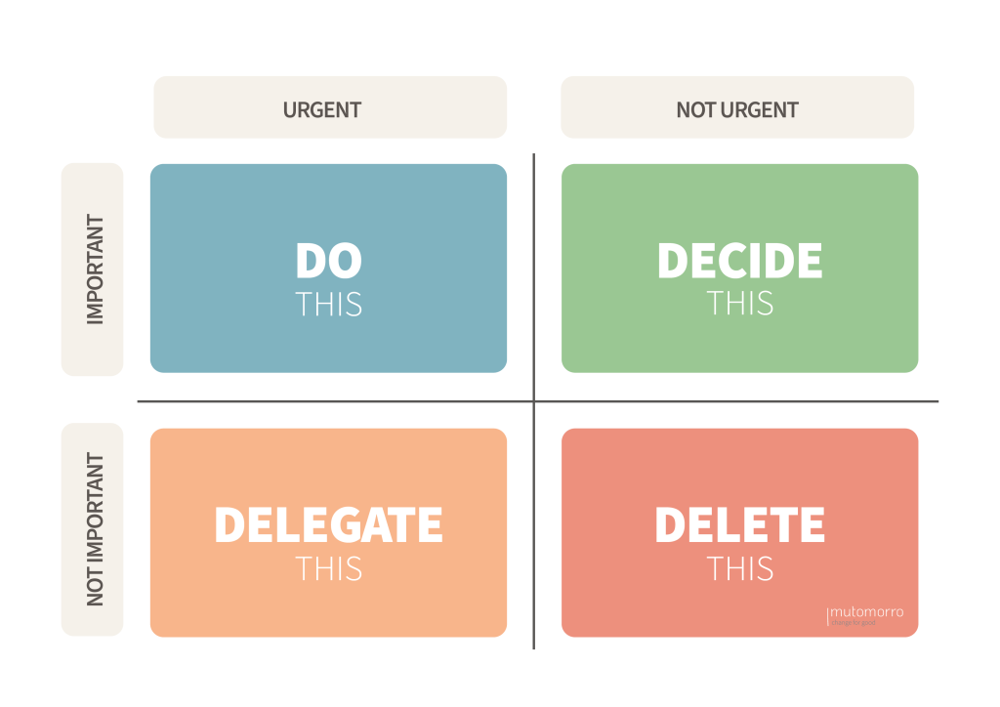

Task Prioritization App 
===============================

A simple, intuitive tool to categorize and prioritize tasks based on urgency and importance using the Eisenhower Method. 

`Project Github <https://github.com/Zak-Bahm/em-proj>`_

`Visit the Site <https://taskprioritization.bahm.com>`_

************************
The Eisenhower Method
************************

.. toctree::
   :maxdepth: 2
   :caption: Contents:
   :hidden:

   getting-started
   accounts 
   navigation
   tasks
   glossary
   troubleshooting

