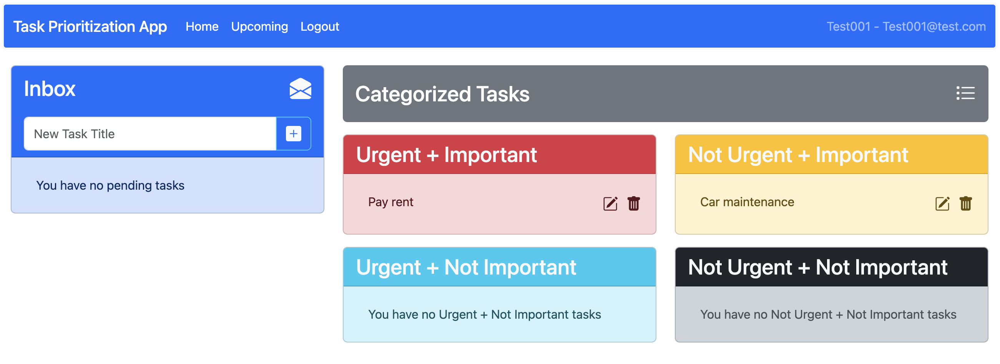

Task Prioritization App 
===============================

The Task Prioritization App is designed to address the growing need for efficient task management among busy professionals, students, and anyone looking to optimize their time. In today’s fast-paced world, managing multiple priorities can be overwhelming. Our app aims to alleviate this burden by providing users with a simple, intuitive tool that helps them categorize and prioritize tasks based on urgency and importance. 

*********************
Getting Started
*********************
The Task Prioritization App is a web-based tool, so no additional software installation is required. Users can access the app directly through their web browser on any desktop or mobile device. Simply open your preferred web browser and visit the app at `https://taskprioritization.bahm.com/ <https://taskprioritization.bahm.com/>`_

System Requirements
---------------------
While the Task Prioritization App is accessible via any modern web browser, the following minimum system requirements are recommended for an optimal experience.

.. epigraph::

    **Browser**: Google Chrome, Mozilla Firefox, Microsoft Edge, or Safari

    **Operating System**: Windows, macOS, or Linux

    **Mobile Compatibility**: Compatible with iOS and Android devices

    **Internet Connection**: A stable internet connection is required for all functionalities

    **Display** Minimum resolution of 1280x720 for desktop or mobile displays

    **JavaScript Enabled**: JavaScript is required and must be enabled in your browser settings

User Accounts
-----------------------
To use the app, you need to create an account. Follow these step to sign up/log in.

.. image:: _static/img/login.png

Signing up
^^^^^^^^^^^^^^^^^
1. Navigate to the app's home page and click on the **Go to Sign Up** button.
2. Fill out the **Sign Up** form by entering your name, email address, and password.

* **Name**: Enter your full name.
* **Email Address**: Use a valid email address that you will use to log in.
* **Password**: Choose a strong password for security.

3. Click the **Sign Up** button to complete the registration process, and will log you in if successfully signed up.

Logging In 
^^^^^^^^^^^^^^^^^
.. NOTE:: 
    If you already have an account you can log in by following these steps.

1. Enter your registered **email address** and **password** into the login form.

2. Click the **Login** button to access your account.

After logging in, you will be redirected to the main dashboard where you can start managing your tasks.

User Management Endpoints
^^^^^^^^^^^^^^^^^^^^^^^^^^^

.. table:: 
    :align: left

    ================    =========   ================================================
    endpoint            type        effect                                                 
    ================    =========   ================================================ 
    /api/register       POST        Registers a new user in the system                     
    /api/login          POST        Authenticates a user and generates a session token     
    /api/logout         POST        Logs out the user, invalidating the session token      
    /api/user           GET         Retrieves the authenticated user's profile information 
    /api/user           PUT         Updates the user's profile                             
    ================    =========   ================================================

*****************************
Navigating the Application
*****************************

The Navbar
-------------
The Task Prioritization App always includes a navbar that floats on top of the web page to allow for easy navigation throughout the app.

The Dashboard 
----------------

From this screen, you can create new tasks, categorize them, and view all your existing tasked based on their urgency and importance.

Once logged in, the main dashboard will display two primary sections: Inbox and Categorized Tasks.

**Inbox**
    The inbox displays tasks that you have created but have not categorized yet and has an input field that allows you to quickly create new tasks.

**Categorized Tasks**
    This section contains tasks categorized into the four quadrants of the Eisenhower Matrix:

    * **Urgent + Important**

    * **Not Urgent + Important**

    * **Urgent + Not Important**

    * **Not Urgent + Not Important**

Inbox 
^^^^^^^^^^^
If you click on the white envelope icon in the header bar of the Inbox section you will go to the dedicated Inbox page.

This page allows for the entire list of uncategorized tasks to be shown and still provides the same editing and task creation abilities as the Dashboard.

In order to navigate back to the Dashboard, simply click **Home** in the navbar.

Categorized Tasks 
^^^^^^^^^^^^^^^^^^
If you click on the gray **Categorized Tasks** header bar, you will go to the dedicated Categorized Tasks page.

This page, like the Inbox page, allows for a full view of all tasks assigned to each category. More info for each task is shown by default, including the description. It also contains the full suite of task creation and edit tools available on the Dashboard.

In order to navigate back to the Dashboard, simply click **Home** in the navbar.

Task Categorization Endpoints
^^^^^^^^^^^^^^^^^^^^^^^^^^^^^^^^

.. table:: 
    :align: left

    ========================            =========   ======================================================
    endpoint                            type        effect                                                 
    ========================            =========   ====================================================== 
    /api/tasks/categorized              GET         Fetches tasks categorized using the Eisenhower matrix 
    /api/tasks/{id}/complete            PUT         Marks a task as complete                                                        
    ========================            =========   ======================================================

*************************
Task Management
*************************

.. image:: _static/img/create-edit.png

Create a task
---------------------

1. In the **Inbox** section, locate the input field labeled **New Task Title**

2. Enter the title of the task you want to create.

3. Click the **+** button next to the input field to add the task to your inbox.

Once added, the task will appear in the **Inbox** as an uncategorized task.

Edit a task
----------------

To edit a task, click the **edit** icon located next to the task title. This opens the **Edit Task** window where you can provide more detailed information.

.. epigraph::
    **Task title**: Modify or update the task title as needed

    **Task description**: Provide a brief description of the task to give more context.

    **Task Due Date**: You can either manually enter the due date or click on the calendar icon to select a specific date from the calendar.

    **Task Status**: Choose between *Pending*,*In progress*, *Completed* based on the current stage of your task.

    **Task Category**: Use the drop-down or select one of teh four category buttons to categorize the task based on its urgency and importance.

Once you have filled in all the necessary details, click on **Save changes** to update the task. this will update all the new task details and move the task to the appropriate category.

Delete a task
----------------
To delete a task, click on the **trash** icon next to the task. A confirmation will be required before the task is permanently deleted.

Task Management Endpoints
^^^^^^^^^^^^^^^^^^^^^^^^^^^^

.. table:: 
    :align: left

    ================    =========   ================================================
    endpoint            type        effect                                                 
    ================    =========   ================================================ 
    /api/tasks          POST        Creates a new task for the authenticated user   
    /api/tasks          GET         Fetches all tasks for the authenticated user    
    /api/tasks/{id}     GET         Retrieves details of a specific task by task ID 
    /api/tasks/{id}     PUT         Updates the task details by task ID             
    /api/tasks/{id}     DELETE      Delets a task by task ID                                                     
    ================    =========   ================================================

.. toctree::
   :maxdepth: 2
   :caption: Contents:
   :hidden:
    
   glossary
   troubleshooting

