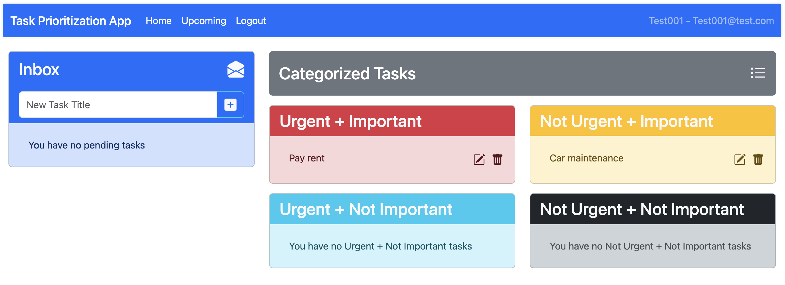

Navigation
============================

The Navbar
-------------
The Task Prioritization App always includes a navbar that floats on top of the web page to allow for easy navigation throughout the app.

The Dashboard 
----------------

From this screen, you can create new tasks, categorize them, and view all your existing tasked based on their urgency and importance.

Once logged in, the main dashboard will display two primary sections: Inbox and Categorized Tasks.

**Inbox**
    The inbox displays tasks that you have created but have not categorized yet and has an input field that allows you to quickly create new tasks.

**Categorized Tasks**
    This section contains tasks categorized into the four quadrants of the Eisenhower Matrix:

    * **Urgent + Important**

    * **Not Urgent + Important**

    * **Urgent + Not Important**

    * **Not Urgent + Not Important**

Inbox 
^^^^^^^^^^^
If you click on the white envelope icon in the header bar of the Inbox section you will go to the dedicated Inbox page.

This page allows for the entire list of uncategorized tasks to be shown and still provides the same editing and task creation abilities as the Dashboard.

In order to navigate back to the Dashboard, simply click **Home** in the navbar.

Categorized Tasks 
^^^^^^^^^^^^^^^^^^
If you click on the gray **Categorized Tasks** header bar, you will go to the dedicated Categorized Tasks page.

This page, like the Inbox page, allows for a full view of all tasks assigned to each category. More info for each task is shown by default, including the description. It also contains the full suite of task creation and edit tools available on the Dashboard.

In order to navigate back to the Dashboard, simply click **Home** in the navbar.

Task Categorization Endpoints
---------------------------------

.. table:: 
    :align: left

    ========================            =========   ======================================================
    endpoint                            type        effect                                                 
    ========================            =========   ====================================================== 
    /api/tasks/categorized              GET         Fetches tasks categorized using the Eisenhower matrix 
    /api/tasks/{id}/complete            PUT         Marks a task as complete                                                        
    ========================            =========   ======================================================
