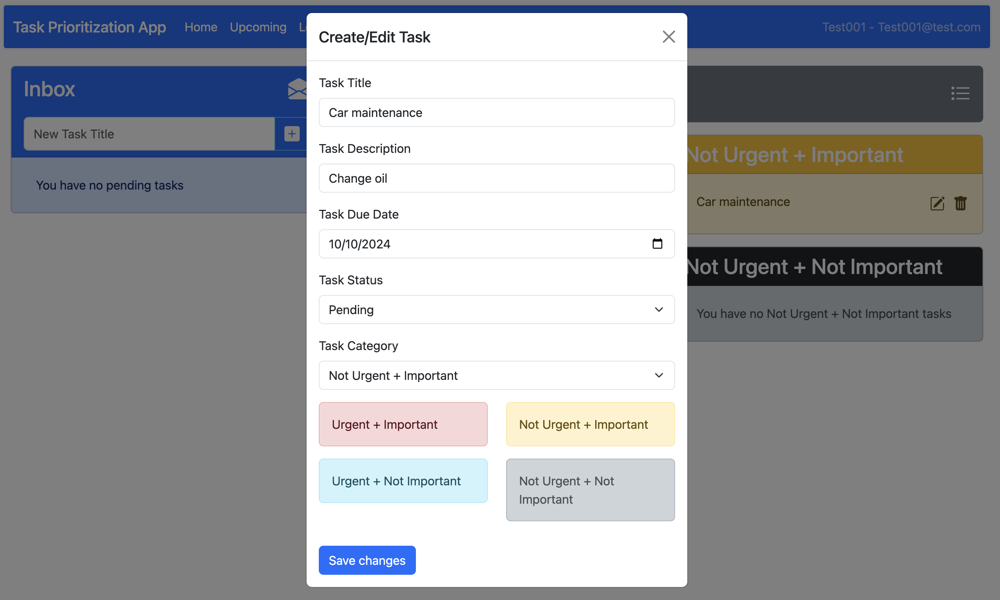

Task Management
=================

Create a task
---------------------

1. In the **Inbox** section, locate the input field labeled **New Task Title**

2. Enter the title of the task you want to create.

3. Click the **+** button next to the input field to add the task to your inbox.

Once added, the task will appear in the **Inbox** as an uncategorized task.

Edit a task
----------------

To edit a task, click the **edit** icon located next to the task title. This opens the **Edit Task** window where you can provide more detailed information.

.. epigraph::
    **Task title**: Modify or update the task title as needed

    **Task description**: Provide a brief description of the task to give more context.

    **Task Due Date**: You can either manually enter the due date or click on the calendar icon to select a specific date from the calendar.

    **Task Status**: Choose between Pending,In progress, and Completed based on the current stage of your task.

    **Task Category**: Use the drop-down or select one of the four category buttons to categorize the task based on its urgency and importance.

Once you have filled in all the necessary details, click on **Save changes** to update the task. this will update all the new task details and move the task to the appropriate category.

Delete a task
----------------
To delete a task, click on the **trash** icon next to the task. A confirmation will be required before the task is permanently deleted.

Task Management Endpoints
---------------------------

.. table:: 
    :align: left

    ================    =========   ================================================
    endpoint            type        effect                                                 
    ================    =========   ================================================ 
    /api/tasks          POST        Creates a new task for the authenticated user   
    /api/tasks          GET         Fetches all tasks for the authenticated user    
    /api/tasks/{id}     GET         Retrieves details of a specific task by task ID 
    /api/tasks/{id}     PUT         Updates the task details by task ID             
    /api/tasks/{id}     DELETE      Deletes a task by task ID                                                     
    ================    =========   ================================================
