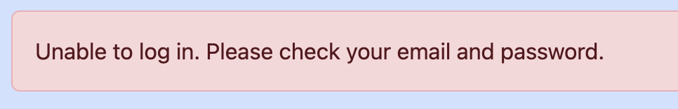
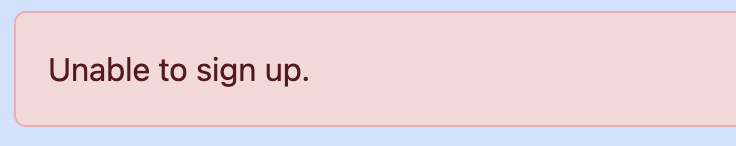
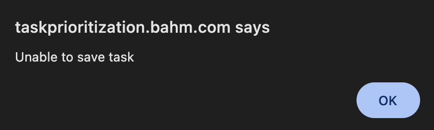

Troubleshooting
====================

The Task Prioritization App is designed to notify users of any issues that occur oduring the signup, login, or task creation process. Below are common errors and how they are handled by the system.

Login errors
----------------

*Error message*: Unable to log in. Please check your email and password.

*Cause*: This error occurs when the user enters incorrect login credentials.

*Resolution*: Verify that the email and password are correct. If you've forgotten your password, follow the "Forgot Password" link to reset it.

Signup errors
---------------

*Error message*: Unable to sign up.

*Cause*: The message appears if the signup process fails, such as if the email is already in use or if other required fields are missing.

*Resolution*: Make sure all fields are completed and that the emaili address is not already registered and valid.

Task creation errors
------------------------

*Error message*: Unable to save task.

*Cause*: This error occurs if the task title is left blank when trying to create or save a task.

*Resolution*: Make sure that the task title field is filled out before pressing the "+" button to add a new task.
